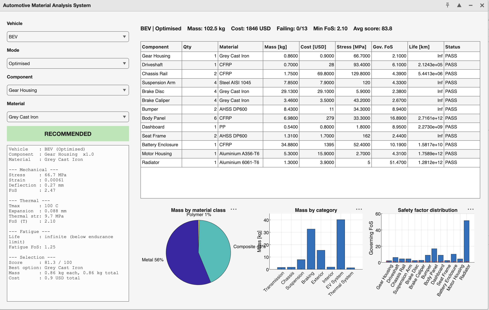

# Automotive Material Analysis & Selection (MATLAB)

A MATLAB tool that analyses candidate materials for automotive components and recommends a material based on engineering trade-offs between strength, weight, fatigue, thermal behaviour, cost and manufacturability.

The project is built as 7 connected phases: each phase uses the outputs of the previous ones, so it works as a single analysis tool rather than a collection of separate calculations.

```
Database -> Physics -> Failure -> Durability -> Lightweighting -> Optimisation -> Engineering decision
```

> **Scope:** analytical / 1D engineering models only. This is **not** FEA and **not** a crash simulation. See [Limitations](#limitations).

## Features

| Phase | Topic | What it does |
|---|---|---|
| 1 | Database | Material library (8 materials) and component library (17 components), each component linked to candidate materials |
| 2 | Static analysis | Stress, strain, deflection, factor of safety (FoS), PASS / FAIL |
| 3 | Thermo-mechanical | Thermal expansion, thermal stress, strength derating with temperature, lumped warm-up curve |
| 4 | Fatigue | Basquin S-N curve, modified Goodman mean-stress correction, life in cycles and km |
| 5 | Impact & lightweighting | Energy absorption (three-point bending model), specific energy absorption (SEA), equivalent mass |
| 6 | Material selection | Weighted multi-criteria scoring, ranking, recommendation, Monte Carlo sensitivity to weights |
| 7 | Vehicle level | ICE / Hybrid / BEV analysis, mass and cost breakdown, safety-factor distribution, GUI dashboard |

Main equations:

- Stress and strain: `sigma = F/A`, `epsilon = sigma/E`
- Factor of safety: `FoS = sigma_y / sigma_max`
- Cantilever deflection: `delta = F L^3 / (3 E I)`
- Thermal expansion and heat: `dL = alpha L dT`, `Q = m cp dT`
- Kinetic energy and SEA: `Ek = 1/2 m v^2`, `SEA = E_absorbed / m`
- Weighted score: `Score = sum(w_i * S_i)`
- Vehicle mass: `M_vehicle = sum(m_i)`

## Requirements

- MATLAB R2018b or later (needed for `yline` and the GUI built with `uifigure` / `uigridlayout`)
- No additional toolboxes are expected to be required

## Repository structure

```
.
├── Phase 1: createMaterialDB.m, createComponentDB.m, getMaterial.m,
│            getCandidateMaterials.m, phase1_main.m
├── Phase 2: sectionProperties.m, defineLoadCase.m, staticAnalysis.m, phase2_main.m
├── Phase 3: thermalDerating.m, defineThermalCase.m, thermalAnalysis.m, phase3_main.m
├── Phase 4: defineFatigueCase.m, fatigueAnalysis.m, phase4_main.m
├── Phase 5: materialDuctility.m, defineImpactCase.m, impactAnalysis.m, phase5_main.m
├── Phase 6: manufacturingScore.m, defineSelectionCriteria.m, collectPhaseResults.m,
│            scoreMaterials.m, sensitivityAnalysis.m, phase6_main.m
└── Phase 7: defineVehicleDB.m, getSpec.m, analyzeComponent.m,
             rankComponentMaterials.m, analyzeVehicle.m,
             phase7_main.m, phase7_dashboard.m
```

## Quick start

1. Clone the repository and open the folder in MATLAB (or add it to the path).

```bash
git clone https://github.com/<your-username>/automotive-material-analysis.git
```

2. Build the material library (creates `materialLibrary.mat`):

```matlab
phase1_main
```

3. Run the single-component workflow (Phases 2 to 6). **All of these phases must use the same component**, so set `component = 'Bumper';` (or any other component) in `phase2_main.m` and `phase5_main.m`, then run them in order:

```matlab
phase2_main
phase3_main
phase4_main
phase5_main
phase6_main
```

Each phase reads the `.mat` file written by the previous one. If you change the component or inputs, re-run every phase in order, otherwise Phase 6 will read outdated results and report that too few materials are common to all phases.

4. Run the vehicle-level analysis (Phase 7). It does not depend on the Phase 2 to 5 result files:

```matlab
phase7_main        % command-line report and plots
phase7_dashboard   % interactive GUI
```

## Customising inputs

- Component, section, load: `USER INPUT` block of each `phaseN_main.m`
- Material properties: `createMaterialDB.m`
- Candidate materials per component: `createComponentDB.m`
- Selection weights: `defineSelectionCriteria(Strength, Weight, Fatigue, Thermal, Cost, Manufacturing)`
- Vehicle components, loads, quantities: `defineVehicleDB.m`

## Case study (to be completed)

Suggested case study: **Battery Enclosure**, comparing aluminium 6061-T6, AHSS DP600 and CFRP.

- Inputs: _add section, load case, thermal and fatigue assumptions_
- Results: _add the output tables and figures after running the code_
- Discussion: _explain the recommended material and the trade-offs_

## GUI



## Limitations

- Each component is idealised as a single equivalent 1D member (rectangular, circular or tubular section). Real geometry, stress concentrations, buckling and joints are not modelled.
- Linear elastic, isotropic material behaviour. CFRP anisotropy (fibre direction) is not modelled.
- Thermal model assumes uniform temperature (lumped) and adds thermal and mechanical stress conservatively.
- Fatigue uses constant-amplitude loading with a Basquin S-N curve and Goodman correction. Miner's rule, corrosion and variable-amplitude loading are not included.
- Impact uses a quasi-static energy balance on a three-point bending beam. Strain-rate effects, local buckling and section collapse are not included. Results are comparative indicators, not crash predictions.
- Material scores are **relative** between candidates of the same component and should not be compared across components.
- Vehicle mass and cost are **equivalent** values from the idealised members, not a real bill of materials. Cost covers raw material only.

## Data disclaimer

Most numerical inputs are **illustrative engineering assumptions**: material properties, loads, section sizes, fatigue factors, failure strains, temperature derating curves and manufacturability scores. They must be checked against reliable sources (e.g. MatWeb, Granta / CES, handbooks, Shigley's Mechanical Engineering Design) before drawing conclusions. Add your references below.

## References

- _Add the sources used for material data and models here._

## Status

The code was written as a learning and portfolio project. Results have not yet been validated against reference solutions or FEA. Validation against textbook examples is planned.

## Roadmap

- Validate Phase 2 to 4 against textbook worked examples
- Replace illustrative data with referenced data
- Per-component impact analysis in Phase 7
- Optional: simple FEA comparison for one component

## License

Released under the MIT License. See [LICENSE.md](LICENSE.md).
